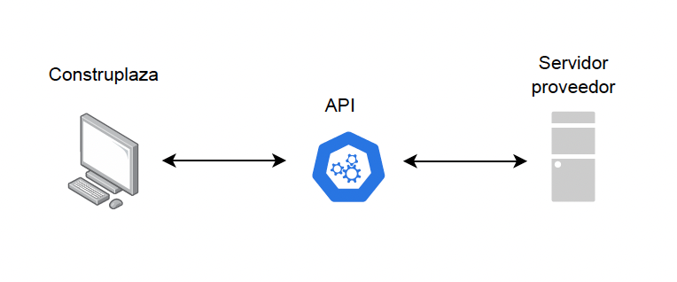
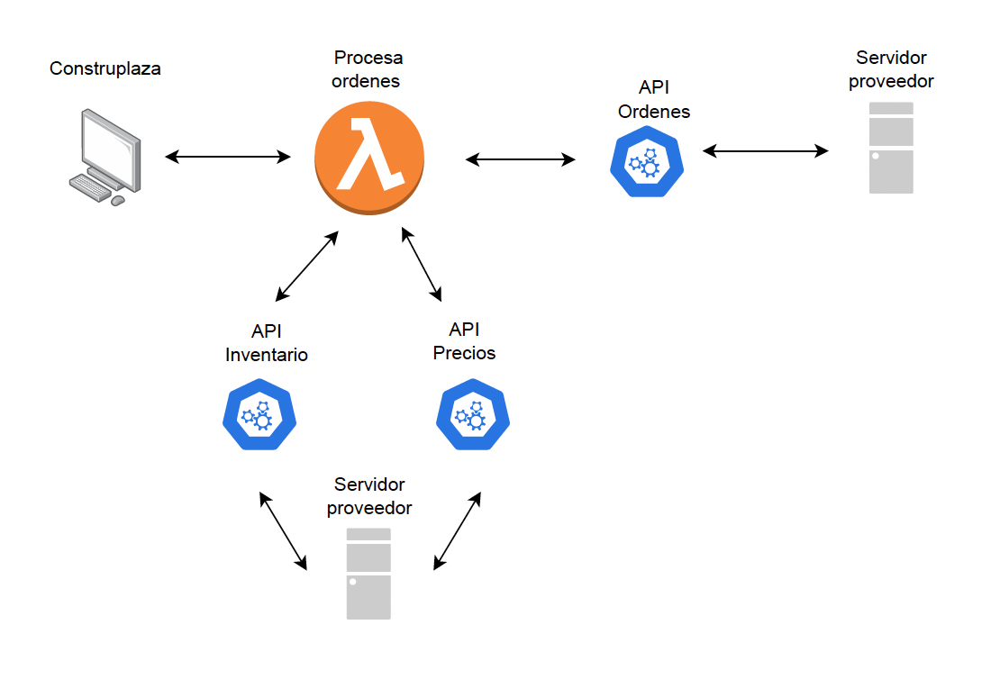

# Requerimientos - Proyecto Construplaza APIs

## Tabla de Contenidos
1. [Introducción](#introducción)
   - [Descripción del Proyecto](#descripción-del-proyecto)
2. [Objetivos del Proyecto](#objetivos-del-proyecto)
   - [Objetivos Específicos](#objetivos-específicos)
3. [Alcance del Proyecto](#alcance-del-proyecto)
   - [Funcionalidades](#funcionalidades)
4. [Requisitos del Proyecto](#requisitos-del-proyecto)
   - [Requisitos Funcionales](#requisitos-funcionales)
   - [Requisitos No Funcionales](#requisitos-no-funcionales)
5. [Fases del Proyecto](#-fases-del-proyecto)
   - [Fase 1 - Consultar Existencia y Costos](#-fase-1---consultar-existencia-y-costos)
   - [Fase 2 - Cargar Pedidos u Órdenes](#-fase-2---cargar-pedidos-u-órdenes)
   - [Fase 3 - Consultar Productos de Pedido Especial](#-fase-3---consultar-productos-de-pedido-especial)
6. [Flujo de Trabajo General para Nuestra Implementación](#flujo-de-trabajo-general-para-nuestra-implementación)
7. [Ambiente de Pruebas](#-ambiente-de-pruebas)
8. [Ejemplos de Integraciones formato API - Fase 1](#-ejemplos-de-integraciones-formato-api---fase-1)

## Introducción

### Descripción del Proyecto

Construplaza está buscando establecer una integración API con nuestros proveedores para obtener datos valiosos que se mostrarán en nuestra página web y para validar información antes de formalizar pedidos u órdenes.

## Objetivos del Proyecto

### Objetivos Específicos

- Establecer una conexión segura con la API externa.
- Obtener datos específicos y relevantes para nuestras operaciones.
- Procesar y mostrar estos datos en tiempo real en nuestra página web.
- Validar la información obtenida antes de formalizar cualquier pedido.
- Generar órdenes automatizadas por medio de API.
- Consultar y generar pedidos especiales (productos que no manejamos).

## Alcance del Proyecto

### Funcionalidades

- **Conexión a la API:** Configurar y establecer una conexión segura con la API externa.
- **Obtención de Datos:** Obtener datos específicos en los llamados a los endpoints detallados en cada fase.
- **Procesamiento:** Asegurar que la información se muestre en tiempo real, es decir, cuando se consulte la API, se obtenga la información real sobre el stock.
- **Envío de Pedidos:** Garantizar una correcta conexión entre el stock validado y el stock del endpoint de la fase 1.
- **Obtención del Catálogo Completo:** Obtener toda la información adicional de los artículos.

## Requisitos del Proyecto

### Requisitos Funcionales

- Establecer una conexión segura con la API del proveedor.
- Ejecutar solicitudes GET y POST para obtener o enviar todos los datos necesarios.

### Requisitos No Funcionales

- Seguridad en la conexión y manejo de datos.
- Alta disponibilidad y tiempo de respuesta rápido.
- Escalabilidad para manejar un gran volumen de solicitudes.

## ⚙️ Fases del Proyecto

### 🔵 Fase 1 - Consultar Existencia y Costos

**Descripción:**
Implementar una funcionalidad que permita consultar la API del proveedor en tiempo real para obtener información actualizada sobre la existencia y costos de los productos.

**Datos Requeridos:**
- Nombre de Artículo
- Impuestos (en caso de tener)
- Bodega (en caso de tener)
- Cantidad (Inventario)
- Precios
- Descuentos (en caso de tener)
- Estado (Activo o Inactivo)
- Moneda (en caso de ser necesario)

**Alcance:**
Configurar la conexión a la API, implementar solicitudes GET para obtener los datos necesarios, procesar estos datos y presentarlos en la página web de manera precisa y en tiempo real.

**Descripcicón grafica:**



### 🔵 Fase 2 - Cargar Pedidos u Órdenes

**Descripción:**
Integrar la funcionalidad para cargar y gestionar pedidos directamente a través de la API proporcionada, permitiendo la automatización del proceso.

**Datos a Enviar:**
- **Información del Pedido:** Detalles completos del pedido, incluyendo número de orden, fecha de creación, y cualquier otra información relevante.

#### Ejemplo

  | Parameter | Type     | Description                       |
| :-------- | :------- | :-------------------------------- |
| `idOrden`      | `string` | **Required**. Puede ser uno de los dos este o idFactura |
| `idFactura`      | `string` | **Required**. Puede ser uno de los dos este o idOrden |
| `fechaCreacion`      | `string` | Fecha de creación del pedido|


- **Detalles del Producto:** Listado de productos incluidos en el pedido, especificando ID y cantidad.

#### Ejemplo de Cuerpo de Solicitud para la API
```json
    {
        "Sku": "ArticuloPrueba1",
        "Quantity": 2,
    },
    {
         "Sku": "ArticuloPrueba1",
         "Quantity": 1,
    }
```
- **Instrucciones Especiales:** Cualquier instrucción especial relacionada con la entrega o manejo del pedido (de ser necesario).

**Proceso de Integración:**
- **Establecer Conexión Segura:** Configurar y establecer una conexión segura con la API del proveedor, utilizando protocolos de seguridad como HTTPS.
- **Autenticación y Autorización:** Implementar mecanismos de autenticación y autorización para el API.
- **Confirmación y Validación:** Validar que el pedido ha sido recibido y procesado correctamente, y recibir número de pedido, número de orden o factura (respuesta de la API).
- **Manejo de Errores:** Implementar el manejo de errores y excepciones, asegurando que cualquier problema en el envío del pedido sea detectado.

#### Formato de Respuesta en Caso de Error
```json
   {
    "Message": "Stock disponible insuficiente para agregar SKU al pedido.",
    "ErrorCode": 23,
   }
```

#### Catálogo de Errores Comunes de la API

| Error codigo          | Mensaje        | 
|----------------|-------------|
| `1`       | No se envio un parametro requerido.       |
| `23`           | Stock disponible insuficiente para agregar SKU al pedido.      | 
| `26`         | TSe solicitan demasiados productos. El número máximo de productos permitidos es.     | 
| `27`  | No se puede agregar un producto a un pedido. Este se encuentra desactivado      |
| `28` | Producto de pedido no autorizado. Por favor consulta el catálogo de productos autorizados.      | 
| `29`       | Lista de productos vacía.       |  
| `30`       | Invalid order.       |  
| `31`       | Se ha especificado un pedido no válido. Asegúrese de que el pedido tenga el formato correcto en el cuerpo de la solicitud.       |  
| `31`       | Se ha especificado un pedido no válido. Asegúrese de que el pedido tenga el formato correcto en el cuerpo de la solicitud.       |
| `33`       | Se ha especificado un pedido no válido. Asegúrese de que el pedido tenga el formato correcto en el cuerpo de la solicitud.       |


**Alcance:**
Configurar la conexión a la API, implementar solicitudes POST para enviar los datos de los pedidos u órdenes, manejar confirmaciones y errores, y presentar el estado del pedido u orden en nuestro sistema interno.

**Descripcicón grafica:**




**Log deseable a recibir en respuesta**

```json
{
    "OrderNumber": "1020192", --Numero de orden del proovedor
    "OrderDate": "2024-08-08T00:00:00",
    "Customer": {
        "CustomerId": "012",
        "Name": "CONSTRUPLAZA S.A",
        "Company": {
            "Id": "XCR",
            "Name": "Costa Rica"
        },
        "Country": {
            "Id": "cr",
            "Name": "Costa Rica"
        }
    },
    "CustomerOrderNumber": "PRPRE09" -- Nuestro numero de orden
}
```
###  🔵 Fase 3 - Consultar Productos de Pedido Especial

**Descripción:**
Habilitar consultas para productos que no se manejan regularmente en nuestro inventario y que requieren pedidos especiales, obteniendo y almacenando información detallada sobre estos artículos.

**Datos Requeridos:**
- Nombre de Artículo
- Descripción del Fabricante
- Fotos
- Categorías
- Tipos
- Marca
- ID del Artículo
- Toda información extra del artículo que pueda ser importante

**Descripción Detallada:**
Implementar una funcionalidad que permita obtener un catálogo completo de los artículos que manejan para guardarlos y mostrarlos como artículos especiales.

**Alcance:**
Configurar la conexión a la API, implementar solicitudes GET para obtener datos sobre productos, manejar la información en múltiples endpoints o en un único endpoint, y almacenar y actualizar esta información en nuestro sistema.

## Flujo de Trabajo General para Nuestra Implementación

### Descripción del Flujo

Al iniciarse el sistema, se establece una conexión segura con la API del proveedor utilizando credenciales almacenadas de manera segura. El sistema realiza solicitudes GET para obtener los datos necesarios, como información de productos, disponibilidad de inventario y precios actualizados. Una vez obtenidos los datos, estos se procesan y se formatean adecuadamente para ser presentados en tiempo real en nuestra página web. La información se actualiza periódicamente para asegurar que siempre se muestra la información más reciente y precisa. Antes de que un pedido sea formalizado, el sistema realiza una validación de los datos obtenidos mediante la API para asegurar su precisión y veracidad.

## 🔧 Ambiente de Pruebas

### Infraestructura

Configurar un entorno que replique el entorno de producción en cuanto a software y a nivel de API.

### Datos de Prueba

Cargar datos de prueba que imiten el volumen y la variedad de datos en producción para validar el comportamiento bajo condiciones similares.

### Seguridad y Accesos

Implementar medidas de seguridad y configuración de accesos adecuados.

Habilitar este entorno hasta finalizar todas las pruebas respectivas.

## 💡 Ejemplos de Integraciones formato API - Fase 1

### Información en un mismo Endpoints

```json
 {
        "idProducto": "PRUEBA01",
        "nombrearticulo": "ARTICULO PRUEBA",
        "impuesto": "IVA 13%",
        "bodega": "4",
        "cantidad": "10",
        "price": "3239.00",
        "descuento": "0%",
        "inactivo": false,
        "moneda" : "CRC"
    },
    {
        "idProducto": "PRUEBA02",
        "nombrearticulo": "ARTICULO PRUEBA 2",
        "impuesto": "IVA 13%",
        "bodega": "2",
        "cantidad": "10",
        "price": "5039.00",
        "descuento": "0%",
        "inactivo": false,
        "moneda" : "CRC"
    }
```


### Información en diferentes Endpoints
#### Endpoint catálogo

```json
{
        "Sku": "ArticuloPrueba1",
        "Description": "Cable potencia 1",
        "Type": "Physical",
        "Manufacturer": {
            "ManufacturerId": "acv",
            "Description": "Accvent"
        },
        "Brand": {
            "ManufacturerId": "acv",
            "BrandId": "xtk",
            "Description": "Xtech"
        },
        "Category": {
            "CategoryId": "cac",
            "Description": "Accesorios para Computadores",
            "Subcategories": [
                {
                    "CategoryId": "cac.cable",
                    "Description": "Cables",
                    "Subcategories": []
                }
            ]
        }
     },
     {
        "Sku": "ArticuloPrueba2",
        "Description": "Cable potencia 2",
        "Type": "Physical",
        "Manufacturer": {
            "ManufacturerId": "acv",
            "Description": "Accvent"
        },
        "Brand": {
            "ManufacturerId": "acv",
            "BrandId": "xtk",
            "Description": "Xtech"
        },
        "Category": {
            "CategoryId": "cac",
            "Description": "Accesorios para Computadores",
            "Subcategories": [
                {
                    "CategoryId": "cac.cable",
                    "Description": "Cables",
                    "Subcategories": []
                }
            ]
        }
    }
```

#### Endpoint de precios

```json
    {
        "Sku": "ArticuloPrueba1",
        "Price": {
            "CurrencyId": "US",
            "UnitPrice": 5.6598
        }
    },
    {
        "Sku": "ArticuloPrueba2",
        "Price": {
            "CurrencyId": "US",
            "UnitPrice": 174.2268
        }
    }

```

#### EndPoint stock

```json
   {
        "Sku": "ArticuloPrueba1",
        "InStock": 10
    },
    {
        "Sku": "ArticuloPrueba2",
        "InStock": 10
    },

```
## Autor

Esto es una propuesta de trabajo desarrollada por CONSTRUPLAZA S.A


